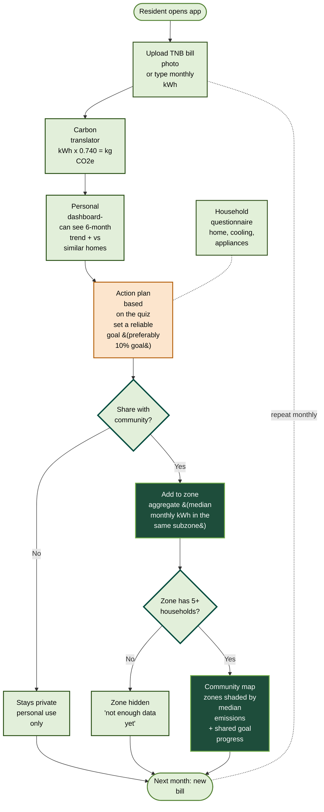

# FLOWCHART

---

```mermaid
graph TD
    %% Nodes
    A([Resident opens app])
    B[Upload TNB bill<br/>photo<br/>or type monthly<br/>kWh]
    C[Carbon<br/>translator<br/>kWh x 0.740 = kg<br/>CO2e]
    D[Personal<br/>dashboard-<br/>can see 6-month<br/>trend + vs<br/>similar homes]
    E[Household<br/>questionnaire<br/>home, cooling,<br/>appliances]
    F[Action plan<br/>based<br/>on the quiz<br/>set a reliable<br/>goal &#40;preferably<br/>10% goal&#41;]
    G{Share with<br/>community?}
    H[Stays private<br/>personal use<br/>only]
    I[Add to zone<br/>aggregate &#40;median<br/>monthly kWh in the<br/>same subzone&#41;]
    J{Zone has 5+<br/>households?}
    K[Zone hidden<br/>'not enough data<br/>yet']
    L[Community map<br/>zones shaded by<br/>median<br/>emissions<br/>+ shared goal<br/>progress]
    M([Next month: new<br/>bill])

    %% Relationships
    A --> B
    B --> C
    C --> D
    D --> F
    E -.- F
    F --> G
    
    G -- No --> H
    G -- Yes --> I
    
    I --> J
    J -- No --> K
    J -- Yes --> L
    
    H --> M
    K --> M
    L --> M
    
    M -.-|repeat monthly| B

    %% Styling
    style A fill:#E2F0D9,stroke:#548235,stroke-width:2px,color:#000
    style B fill:#E2F0D9,stroke:#385723,stroke-width:2px,color:#000
    style C fill:#E2EFDA,stroke:#274E13,stroke-width:2px,color:#000
    style D fill:#E2EFDA,stroke:#274E13,stroke-width:2px,color:#000
    style E fill:#E2F0D9,stroke:#385723,stroke-width:2px,color:#000
    style F fill:#FCE5CD,stroke:#B45F06,stroke-width:2px,color:#000
    style G fill:#E2EFDA,stroke:#004D40,stroke-width:3px,color:#000
    style H fill:#E2EFDA,stroke:#274E13,stroke-width:2px,color:#000
    style I fill:#1E4D3B,stroke:#70AD47,stroke-width:2px,color:#FFF
    style J fill:#E2EFDA,stroke:#004D40,stroke-width:3px,color:#000
    style K fill:#E2EFDA,stroke:#274E13,stroke-width:2px,color:#000
    style L fill:#1E4D3B,stroke:#70AD47,stroke-width:2px,color:#FFF
    style M fill:#E2F0D9,stroke:#548235,stroke-width:2px,color:#000
```
